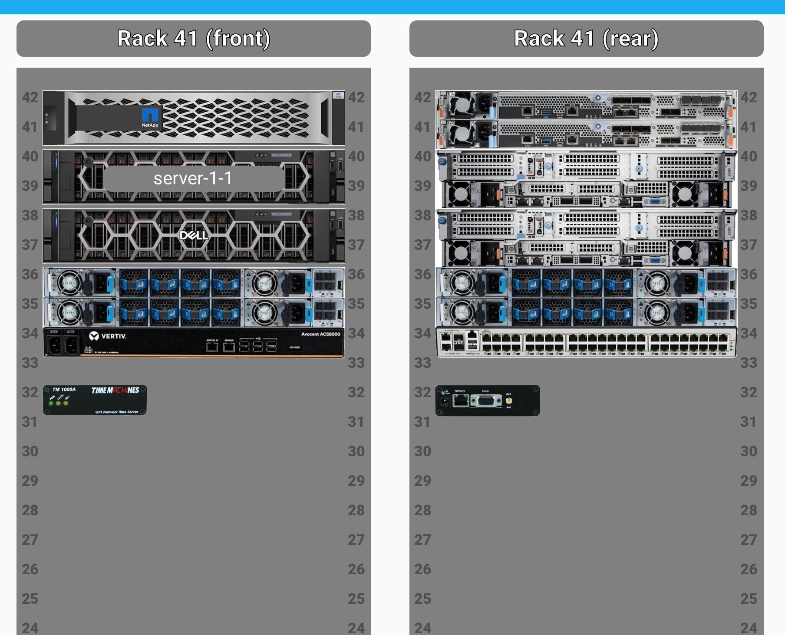
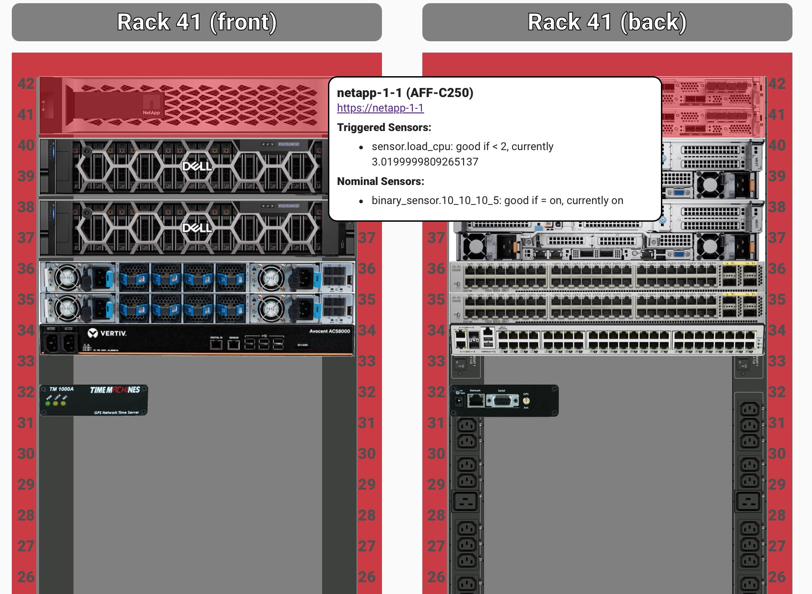
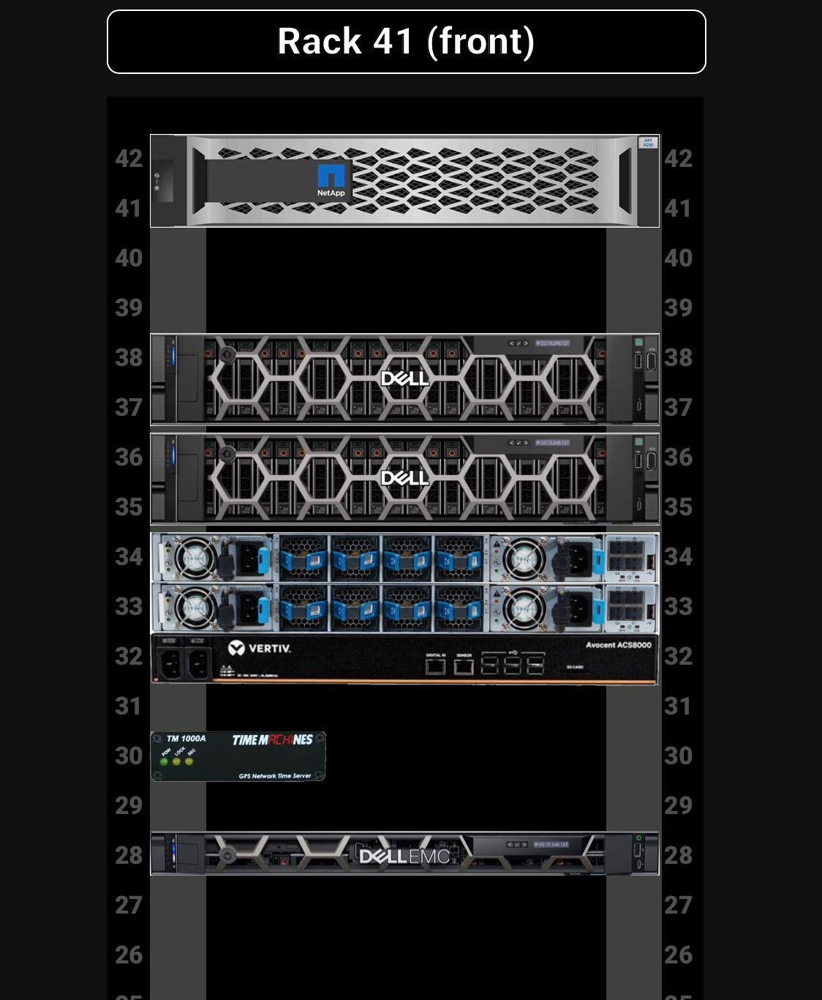

# Overview

This is a lovelace plugin for home assistant that allows you to monitor racked equipment.  

# Installation
In order to use this plugin you need to install the 'racker-stacker.js' inside the 'www/racker-stacker/' in HA. There must also be 'racks' and 'models' subdirs inside the 'racker-stacker' directory.

# Card Creation
Once you have populated all the rack and equipment yamls you can use them on a card as follows:

```yaml
type: custom:racker-stacker
name: Rack 41 (front)
flip: false
rack: rack41
```

This produces something like the following: 

Each equipment can track any number of sensors.  If any of these sensors are bad the following occurs in order to alert you:
  - the "bad" equipment pulses red
  - the rack containing the "bad" equipment also pulses red
  - if you hover over the bad equipment it will show sensor(s) are causing the error

An example of this is shown here: 

# Dark Mode
We also support dark mode: 


## Other Card Options
You can also specify an initial scroll offset which is useful if you want to focus on a specific section of the racks on load.  Just add "scrollx" and/or "scrolly" attributes to the card.


# Rack Models
Rack models are yaml files placed in "www/racker-stacker/racks/[rackname].yaml" relative to the HA configuration dir. Once the yaml is created, a card can reference [rackname] can as shown above. Rack models are refreshed, without caching, once per second.   An example rack is shown below:

```yaml
facing: "rear" # optional; defaults to "front"
rack_height: 42  # optional: defaults to 48
equipment:
  - hostname: switch-1-1
    entity: binary_sensor.switch-1-1-rollup 
    model: cisco_3890U
    rack_u: 48
    url: "https://netapp-1-1"
  - hostname: server-1-1
    entity: 
      - binary_sensor.server-1-1-raid-integrity = 'on'
      - sensor.server-1-1-power-supplies-healthy  = 2
      - sensor.server-1-1-root-percent-full < 90
    model: dell_r7625
  ... 
```

## Entities and Thresholds
In the example shown above each instance of a model can have an "entity" attribute containing one or more sensor expressions.  The sensor expression is of the form [entityName] [op] [threshold].  The entity can be any entity in HA.  The op can be one of >, >=, <, <=, =, or !=.  The types of the entity must match those of the threshold - in other words, both must be numbers or both must be strings.   If the ha state is a string, the threshold must be surrounded with single quotes.


A few notes:
  - url is optional - if provided, a corresponding link will be shown as you hover over the equipment
  - Equipment orientation is inherited from the rack - however you can override this on individual items by adding a "facing" property (acceptable values are "rear" or "front")

# Equipment Models 

Equipment models are placed inside HA in www/racker-stacker/models/ as follows:
  - Model metadata: "[modelname].yaml"
  - Front image: "[modelname]_front.jpg"
  - Rear image: "[modelname]_rear.jpg"

All three files must be present for the model to be considered good. Any image format for the front and rear is supported - but jpg is the default.  A few sample models are included in this repo - including a NetApp C250 and a Time Machine NTP box.  

## Model Metadata 
Each model's metadata is a yaml containing the following:
  - width_inches (required) - equipment width in inches
  - rack_u (required) - equipment height in U
  - img_type (optional) - gives the image suffix of each equipment; if not provided defaults to "jpg"

## Model Images
The front and rear images must both be provided.  Images can be any resolution, although in practice a single u, full-width item will be 410x40px.  Thus it is recommended your image be no larger than 410 wide and some multiple of 40px, per rack U.  If the equipment is less than a full width, that is fine, just specify the width in inches in the model file.


# Future Work
We're tracking the following future work items:
  - multiple racks - Right now this card works really well for one or two racks.  More than that and you have some UI problems arise - namely, how to show everything? Need to look into panel mode, and see if we can get some better horizontal space.  Needless to say right now this isn't meant for modelling [Colossus](https://www.supermicro.com/CaseStudies/Success_Story_xAI_Colossus_Cluster.pdf)
  - ACK pulsing red - if you see something going wrong, but cannot fix it immediately, you might want to stop the pulsing for that equipment; we might add an "ACK" state to let you suppress the pulsing


