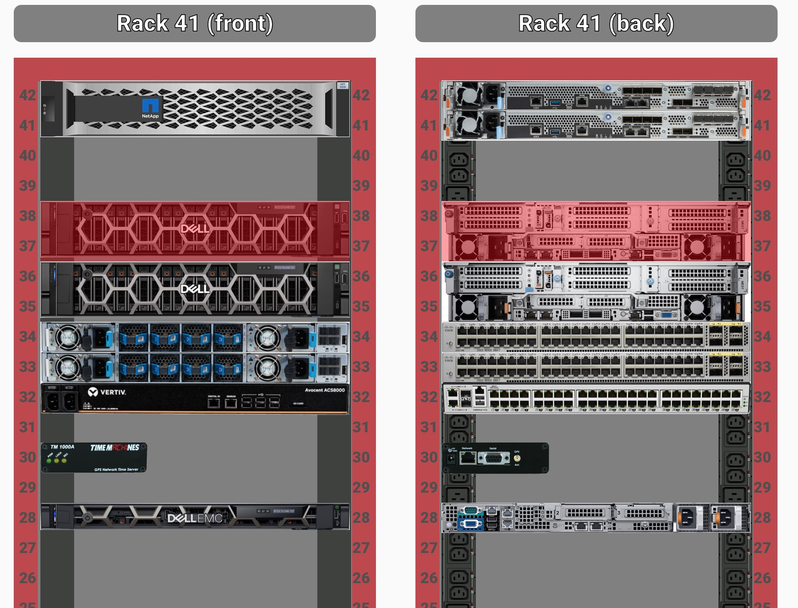

# Overview

This is a lovelace plugin for home assistant that allows you to monitor racked equipment.  

In order to use this plugin you need to install the 'racker-stacker.js' inside the 'www/racker-stacker/' in HA. There must also be 'racks' and 'models' subdirs inside the 'racker-stacker' directory.

Once you have populated all the rack and equipment yamls you can use them on a card as follows:

```yaml
type: custom:racker-stacker
name: Rack 41 (front)
flip: false
rack: rack41
```

This produces something like the following: 

If any equipment has an error the view is rendered differently.  In this case:
  - the bad equipment pulses red
  - the rack containing the bad equipment also pulses red
  - if you hover over the bad equipment it will show sensor(s) are causing the error

An example rack with bad equipment is shown here: 


# Rack Models
Rack models are yaml files. They must be placed in "www/racker-stacker/racks/[rackname].yaml" inside the HA install dir. Note that [rackname] can then be referenced in the card as shown above.   The format is:

```yaml
facing: "rear" # optional; defaults to "front"
rack_height: 42  # optional: defaults to 48
equipment:
  - hostname: switch-1-1
    entity: binary_sensor.switch-1-1-rollup 
    model: cisco_3890U
    rack_u: 48
    url: "https://netapp-1-1"
  - hostname: server-1-1
    entity: 
      - binary_sensor.server-1-1-raid-integrity = 'on'
      - sensor.server-1-1-power-supplies-healthy  = 2
      - sensor.server-1-1-root-percent-full < 90
    model: dell_r7625
  ... 
```

A few notes:
  - The url is optional - but provides a link to visit the equipments 
  - Normally equipment assumes the orientation of the rack - but you can flip individual items by adding "facing" to each equipment and setting it to "rear" or "front"
  - 

# Equipment Models 

Equipment models are placed inside HA in www/racker-stacker/models/ as follows:
  - Model metadata: "[modelname].yaml"
  - Front image: "[modelname]_front.jpg"
  - Rear image: "[modelname]_rear.jpg"

All three files must be present for the model to be considered good. Any image format for the front and rear is supported - but jpg is the default.  A few sample models are included in this repo - including a NetApp C250 and a Time Machine NTP box.  

## Model Metadata 
Each model's metadata is a yaml containing the following:
  - width_inches (required) - equipment width in inches
  - rack_u (required) - equipment height in U
  - img_type (optional) - gives the image suffix of each equipment; if not provided defaults to "jpg"

## Model Images
The front and rear images must both be provided.  Images can be any resolution, although in practice a single u, full-width item will be 410x40px.  Thus it is recommended your image be no larger than 410 wide and some multiple of 40px, per rack U.  If the equipment is less than a full width, that is fine, just specify the width in inches in the model file.


## Entities and Thresholds
In the example shown above each item can have an "entity" attribute containing one or more expressions.  The expression is of the form [entityName] [op] [threshold].  The entity can be any entity in HA.  The op can be one of >, >=, <, <=, =, or !=.  The types of the entity must match those of the threshold - in other words, both must be numbers or both must be strings.   If the ha state is a string, the threshold must be surrounded with single quotes.


