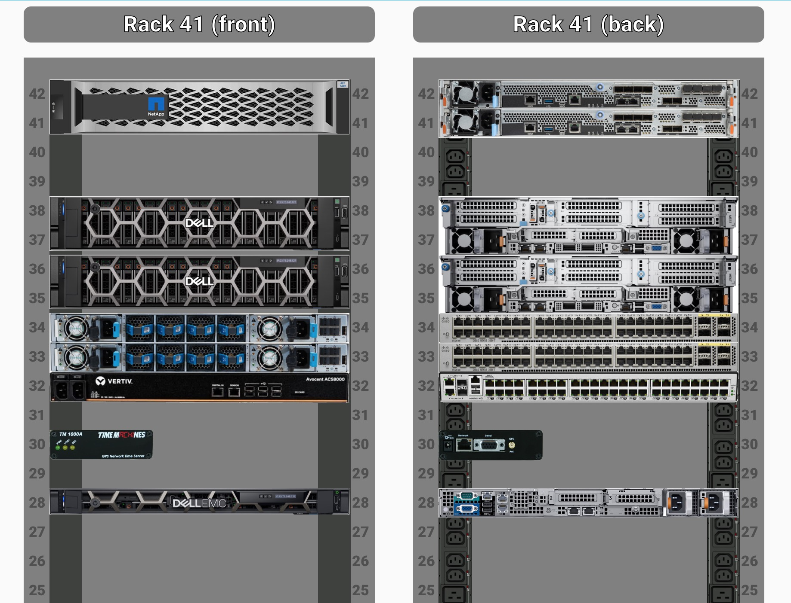

# Overview

This is a lovelace plugin for home assistant that allows you to monitor racked equipment.  

Racks are defined in a yaml which lists the equipment and sensors to monitor.  Equipment defined separately, one model per yaml file, and defines things such as the physical dimensions of the equipment.  The rack and equipment yamls all reside on the HA server under www/racker-stacker - in the "racks" and "models" directories, respectively.

Once you have defined the racks and equipment models, instantiating them into a new card is easy:

```yaml
type: custom:racker-stacker
name: Rack 41 (front)
rack: rack41
```

This produces something like the following: 

If any equipment has an error the view is rendered differently.  In this case:
  - the bad equipment pulses red
  - the rack containing the bad equipment also pulses red
  - if you hover over the bad equipment it will show sensor(s) are causing the error

An example rack with bad equipment is shown here: 

# Rack Models
Rack models are yaml files. They must be placed in "www/racker-stacker/racks/[rackname].yaml". Note that [rackname] can then be referenced in the card as shown above.   The format is:

```yaml
facing: "rear" # optional; defaults to "front"
rack_height: 42  # optional: defaults to 48
equipment:
  - hostname: switch-1-1
    entity: binary_sensor.switch-1-1-rollup 
    model: cisco_3890U
    rack_u: 48
  - hostname: server-1-1
    entity: 
      - binary_sensor.server-1-1-disks-healthy
      - binary_sensor.server-1-1-power-supplies-healthy
    model: dell_r7625
  ... 
```


# Equipment Models 

In order to include an equipment in your rack you must define an equipment model. Equipment models include images and metadata.  Model files are placed inside HA in www/racker-stacker/models/ as follows:
  - Model metadata: "[modelname].yaml"
  - Front image: "[modelname]_front.jpg"
  - Rear image: "[modelname]_rear.jpg"

Note that any image format is supported - but jpg is the default.  A few sample models are included in this repo - including a NetApp C250 and a time machine NTP box.  

## Model Metadata 
Each model's metadata is a yaml that contains the following:
  - width_inches (required) - equipment width in inches
  - rack_u (required) - equipment height in U
  - img_type (optional) - gives the image suffix of each equipment; if not provided defaults to "jpg"

## Model Images
The front and rear images must both be provided.  Images can be any resolution, although in practice a single u, full-width item will be 410x40px.  Thus it is recommended your image be no larger than 410 wide and some multiple of 40px, per rack U.  If the equipment is less than a full width, that is fine, just specify the width in inches in the model file.


## Rollup sensors
In the example shown above each item can have an "entity" attribute containing one or more.  If any of the sensors are not "on", an error will be shown.  Note: we only support binary sensors for now, but could easily support other sensors with a small code change.  For now, we consider the sensor entities to be "rollup" sensors - specifying whether something is wrong or not - hence binary sensors seem appropriate.


